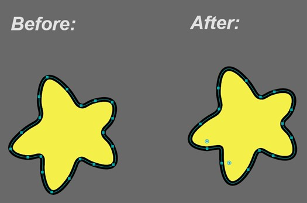
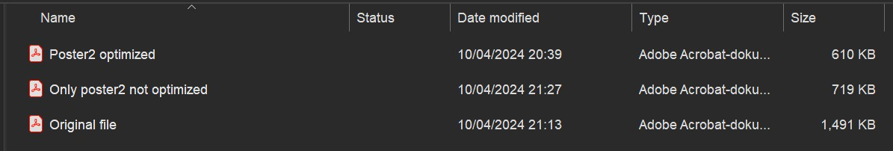

# **Report**

## **Our Process**

### **_TASK 1 – Extracting and improving_**

The first thing we did was picking a poster, we chose poster 2. We started with looking into the poster.pdf file. and doing A LOT of cleaning. There were a bunch of unnecessary anchor points and used text and images left being. By removing the those we were able to cut down half of the size of the file We also made sure to cut down / remove parts of the poster that was overflowing the poster, reducing its size This is important to do in order to be more sustainable and cut the power needed to load the svgs.

noticeable unwanted things were removed, we moved on to optimizing the each of the SVGs that we were going to extract. We did this by using Object/Path/Simply, A tool that cuts down unnecessary anchor points and reduces the files size, while still maintaining the shape. Here is an example:

It might seem unimportant but by doing this we were able to cut down ca. 100kb of unnecessary data. Here is an overview of how much of the size we were able to cut down by first removing unnecessary stuff and then after optimizing the elements.

**_(These are available under the documentation folder)_**

### **_TASK 2 – Implementation_**

After alle the elements were ready we moved over to implementing them all. We started with switching between working with the layout and implementing animations. We made the decision to divide each wave in the poster into their own section. This was good for both the structure and made it easy to style. By using position relative and absolute we were able to move the elements as we wanted.

We started by positioning elements on the page by trying to use “vw” for sizing elements on the page, this way we thought that things would be sized appropriately according to each other while keeping their responsiveness. But we discovered that positioning the elements absolutely as well with keeping the elements within the body when trying to give the poster its “poster” appearance gave us the revelation that we had started the structuring of the project wrong, and that we needed to “start over” by using px sizing for the poster ID which we then positioned relatively and followed it up with other relatively positioned sections within the poster so that we then could position the other svg’s in the poster, while still containing everything within the body. This approach gave us a lot of good control and oversight when positioning the svg’s as well as controlling the overall poster look and animations.

When it came to the drawings. We drew the eyes in the earth using border radius we used the tools _\[Found_ [_Here_](https://9elements.github.io/fancy-border-radius/full-control.html#44.41.55.48-46.42.48.42-)_.\]_ provided from the lecture about CSS drawings. We used this to find calculate the number for the border-radius. Then we adjusted the height and weight appropriate. For the SVG drawing we recreated the cylinders in the footer. This is made out of a rectangle that uses rx and ry to round of the corners.

### **TASK 3 - Animations**

We made sure to use a lot of different types of animations, using a combination of SMIL animations and keyframes animation, in combination with some hover effects. This made the poster more energetic and more engaging.

#### **Smil animations:**

We used a variety of different SMIL animations, for the “car” animation we used SMIL path animations, we achieved this by setting the "moveto” or starting point x = -1500 and y = 390, which gets the effect of the car driving from outside the poster and in, before following the blue “wave” formation and past the moon with the help of the “curveto” coordinates and then ends on the cordinates x= 837, and y= -1500, which drives the car “outside” the poster, and we used “animateMotion dur=20s repeatCount =”indefinite” ” and linked it to the path ID to make the animation engage. We did this highlight the message behind the car svg, as well as give the effect that it is driving to the moon.

For The big green “co2” monster we used SMIL animate and used the type= “Scale” together with values: “1;0.8;1” with 3s duration. This will scale the monster down to 80% of its original size and then back within 3 seconds, and give the effect that it “pulsates”, making it look alive as well as threatening.

We used SMIL transform for the leftmost kid’s hand. To make the hand move is used to transform the arm, making it look like it is waving. By adding the values: “0,0; 4,5; 0” the arm moves diagonally make the kid more feel more alive. By adding a duration of 8 seconds and making it repeat infinite the animations look natural and flows well with the rest of the poster.

#### **Keyframes:**

We used a variety of different keyframe techniques in this task, these are the different names of keyframes we used and their effects

**backAndForth-left** \- this is a keyframe uses a 0% to 50% to 100% logic that makes the animation go through different points within its animation duration, along with transform:translate property that is used to move the element from its current position. This element in particular is made for the left eyeball of the earth SVG giving it the effect that it looks around by moving the eye back and forth on the x-axis. This gives the earth a more personal touch and gives the effect that it is alive and that we need to take good care of it.

**rotate-then-back –** this keyframe we used the same logic as the eyes of the earth but used the transform:rotate function set to “tilt” the element one way and then eaqually the other way (-30deg to 30deg) to get the effect that it is rocking back and forth. In this case we only used this effect to the moon.

**Spin -** This keyframe animation makes the co2 clouds rotate 360degres infinitely by using transform causing them to spin around. We applied this to when the user hovers any of the animated clouds. This serves as a fun easter egg and we thought that kids that visits the website would find it funny.

**Bounce -** Bounce uses transform: translateY to move the co2 clouds vertically. By having the values 0%, 50% 100% the cloud goes up 20px and then goes back down 0px. They also have linear property assign to them making it so that they do not stop. At last the infinite property makes the clouds repeat themselves. This effect makes the cloud feel more alive and makes them seem more like clouds. We also set the timing on the different sizes of clouds so that they wouldn’t be “in-sync” with each other to give them a more chaotic appearance.